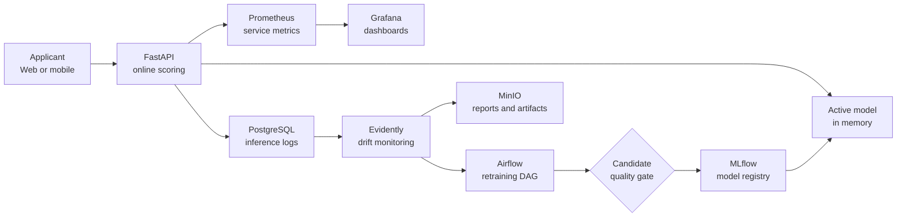

# DDM501: INDIVIDUAL ASSIGNMENT 1
# MACHINE LEARNING SYSTEM DESIGN DOCUMENT

**Course:** DDM501 — AI in DevOps, DataOps, MLOps  
**Assignment:** Individual Assignment 1 (Weight: 5%)  
**Class:** MSA36HN_DDM501  
**System Title:** Enterprise Real-Time Credit Default Risk Scoring & Monitoring Platform  
**Target Domain:** Financial Technology (FinTech) / Digital Retail Banking  
**Feature Schema Reference:** UCI Default of Credit Card Clients (schema reference only; this submission does not use the UCI observations)  
**Student Name:** Nguyễn Thái Thịnh 
**Student ID:** 25MS13304 
**Submission Date:** 5 October 2026 
**Submission PDF:** `DDM501_Assignment1_25MS13304_Nguyen_Thai_Thinh.pdf`

<h2>TABLE OF CONTENTS</h2>

- [Executive Summary](#executive-summary)
- [1. Problem Definition](#1-problem-definition-20)
  - [Context and Background](#11-context-and-background)
  - [Problem Statement](#12-problem-statement)
  - [Current Situation and Baseline Operations](#13-current-situation-and-baseline-operations)
  - [Justification for Machine Learning](#14-justification-for-machine-learning)
  - [Stakeholders](#15-stakeholder-identification-and-concern-matrix)
- [2. Requirements Analysis](#2-requirements-analysis-20)
  - [Functional Requirements](#21-functional-requirements-fr)
  - [Non-Functional Requirements](#22-non-functional-requirements-nfr)
  - [Data Requirements](#23-data-requirements)
- [3. Goals and Metrics Hierarchy](#3-goals-and-metrics-hierarchy-20)
- [4. High-Level Architecture Design](#4-high-level-architecture-design-25)
- [5. Trade-Offs Analysis](#5-trade-offs-analysis-15)
- [6. Conclusion and Next Steps](#6-conclusion-next-steps)
- [7. References](#7-references)

---

## EXECUTIVE SUMMARY

This report proposes an end-to-end design for a credit-default risk platform and explains its functional requirements, target metrics, architecture, and trade-offs. The intended design uses an API for online scoring and separate MLOps services for audit, monitoring, experiment tracking, and scheduled retraining.

**Evidence boundary:** the figures for customer volume, costs, latency, accuracy, loss reduction, and service levels are scenario assumptions or proposed targets unless explicitly identified as measured. No production banking system, UCI dataset experiment, legal review, or deployment is included. The accompanying Python reference engine is a hand-written heuristic, not a trained, calibrated, or fairness-validated model; its unit tests verify software contracts and a local function-time check only. The Four-Fifths ratio is treated as a screening metric, not a legal-compliance determination.

---

## 1. PROBLEM DEFINITION (20%)

### 1.1 Context and Background

Consumer credit lending represents the financial backbone of modern digital banking. In digital credit card origination, financial institutions extend revolving credit lines to applicants based on their estimated propensity to default within a defined future horizon. Customers expect timely onboarding via mobile and web channels. The portfolio size and abandonment figures below are scenario assumptions, not sourced empirical findings.

For illustration, a hypothetical \$500,000,000 portfolio with a 1.0 percentage-point change in loss rate would correspond to \$5,000,000 before recovery, timing, and exposure effects. This arithmetic is not a forecast or measured loss estimate. The design therefore treats portfolio outcomes as business hypotheses requiring validation by a bank's risk and compliance teams.

### 1.2 Problem Statement

Formulated in quantitative, measurable engineering terms:

> **How should a digital retail banking platform be designed to target real-time credit-default risk underwriting for a hypothetical 100,000 monthly revolving-card applications, with p95 inference latency below 50 milliseconds, a target ROC-AUC of at least 0.77 and F1 of at least 0.52, a proposed 75% reduction in manual review, 99.9% availability, and a Fair Lending screening range of $0.80 \le \text{DIR} \le 1.25$ for explicitly defined cohorts?**

### 1.3 Current Situation and Baseline Operations

Currently, the organization relies on legacy rule-based heuristic scorecards combined with manual human underwriter review:

> The operational figures and practices in this scenario are illustrative assumptions for requirements analysis; they are not measurements from a named bank or dataset.

1. **Static FICO and Debt-to-Income (DTI) Hard Cutoffs**:
    - Applicants with credit scores above 720 and DTI below 30% are automatically approved.
    - Applicants with credit scores below 620 or DTI above 45% are automatically declined.
2. **The "Gray Zone" Bottleneck**:
    - Approximately 42% of all applicants fall into the intermediate "gray zone" (scores 620–720 or irregular repayment records).
    - All gray-zone applications are routed to a human underwriting queue, requiring 24 to 72 hours for document verification, income confirmation, and subjective risk appraisal.
3. **Operational Deficiencies**:
    - **High Customer Churn**: 38% of gray-zone applicants abandon their applications or accept competitor pre-approved offers during the multi-day waiting window.
    - **Inflexibility for "Thin-File" Borrowers**: Young professionals and gig-economy workers lacking multi-year credit bureau records are systematically rejected, forfeiting high-lifetime-value prime customers.
    - **Inconsistent Decisions**: Human underwriters exhibit significant inter-rater variability (variance exceeding 23% for identical applicant risk profiles under end-of-quarter pressure).

### 1.4 Justification for Machine Learning

A Machine Learning approach is fundamentally superior to heuristic rule-based systems for credit default prediction due to several domain-specific factors:

* **High-Dimensional Non-Linear Interactions**: An applicant's default propensity is rarely determined by a single metric. It emerges from intricate interactions between longitudinal billing trajectories ($\text{BILL\_AMT}_1 \dots \text{BILL\_AMT}_6$), repayment delay signals ($\text{PAY}_0 \dots \text{PAY}_6$), revolving credit line utilization ($\text{BILL\_AMT} / \text{LIMIT\_BAL}$), and payment-to-bill ratios. Gradient Boosted Decision Trees natively partition non-linear risk spaces that rule-based systems cannot express without thousands of fragile `if-else` branches.
* **Probabilistic Outputs (subject to validation)**: A trained model can produce risk estimates $P(\text{default} \mid \mathbf{x}) \in [0, 1]$. Calibration must be measured on representative held-out data before these values are used for pricing or decisions. A hand-written score or sigmoid transform is not calibration. A proposed routing policy is:
  - **Tier 1 (Instant Approval)**: $P < 0.30$ $\rightarrow$ Sub-second credit approval with automated credit limit determination.
  - **Tier 2 (Targeted Human Review)**: $0.30 \le P < 0.60$ $\rightarrow$ Focused triage with SHAP feature attribution highlighting exact risk flags.
  - **Tier 3 (Instant Decline)**: $P \ge 0.60$ $\rightarrow$ Automated rejection with legal Adverse Action Notice codes.
* **Continuous Macroeconomic Adaptation**: Consumer financial behavior shifts during inflationary cycles or economic shocks. Supervised ML pipelines with automated drift monitoring (Evidently AI) and scheduled retraining (Airflow) dynamically update model parameters to reflect contemporary credit regimes, preventing silent model degradation.

> The scenario values in Sections 1.3–1.5 are illustrative assumptions used to make the design requirements concrete; they have not been measured in a real financial institution.

### 1.5 Stakeholder Identification and Concern Matrix

The platform must satisfy five distinct stakeholder groups with divergent operational priorities:

| Stakeholder | Key Strategic Objectives | Primary Concerns & Constraints | System Success Criteria |
| :--- | :--- | :--- | :--- |
| **Loan Applicants (Borrowers)** | Instant credit decisions ($< 3\text{s}$ digital checkout UX), fair risk assessment, transparent limits. | Biased rejections, arbitrary black-box denials without clear explanation. | End-to-end response time $< 3\text{s}$; clear Adverse Action reasons if declined. |
| **Credit Underwriters (Operations)** | Elimination of routine prime cases, focused triage queue for genuine edge cases. | Cognitive overload, lack of interpretable feature drivers, inability to override model decisions. | $75\%$ reduction in manual caseload; top-3 risk attribution drivers per application. |
| **Chief Risk Officer / Board (Business)** | Portfolio NPL reduction, interest revenue expansion, capital efficiency. | Severe default contagion during recession, unexpected financial loss, regulatory exposure. | Define and approve portfolio targets after establishing a measured baseline and loss model. |
| **Compliance & Legal Officers (Governance)** | Strict adherence to ECOA, FCRA, CFPB, and Basel III supervisory guidelines. | Algorithmic disparate impact against protected classes (gender, age), unexplainable denials. | Disparate Impact Ratio $0.80 \le \text{DIR} \le 1.25$; 100% audit logging in PostgreSQL. |
| **MLOps & DevOps Engineers (Platform)** | Sub-50ms latency SLA, 99.9% API uptime, zero-downtime blue/green hot-reloading. | Covariate drift, data schema corruption, ground-truth label latency, cascading service failures. | p95 latency $< 50\text{ms}$; automated Airflow retraining triggered upon $\text{PSI} \ge 0.25$. |

---

## 2. REQUIREMENTS ANALYSIS (20%)

### 2.1 Functional Requirements (FR)

* **FR-1: Real-Time Scoring Microservice (`POST /predict`)**  
  The system must expose a RESTful inference endpoint accepting a JSON payload containing the 23 applicant features. The service must validate input integrity, execute feature transformations, and return:
  1. Binary prediction outcome: `0` (Non-default / Safe) or `1` (Default risk).
  2. Calibrated default probability: $P(\text{default}) \in [0.0000, 1.0000]$.
  3. Optional illustrative 300–850 risk score mapping. It is not a FICO score and must not be represented as a bureau score.
  4. Operational decision tier: `PRIME` ($P < 0.15$), `NEAR_PRIME` ($0.15 \le P < 0.30$), `SUBPRIME` ($0.30 \le P < 0.60$), or `HIGH_RISK` ($P \ge 0.60$).
  5. Dynamic recommended credit limit: Scaled credit limit calculated as $\text{LIMIT}_{\text{rec}} = \text{LIMIT\_BAL} \times (1.0 - P)$.

* **FR-2: Regulatory Explainability & Adverse Action Notice Generation**  
  For declined applications, the proposed system should provide decision explanations. Model attributions can be candidate inputs to a legally reviewed reason-code mapping; raw SHAP features or heuristic text are not, by themselves, compliant adverse-action codes.

* **FR-3: Immutable Transactional Audit Logging**  
  For every inference invocation, the service must synchronously record a structured audit row into a PostgreSQL table (`inference_logs`). The recorded record must contain: `request_id` (UUIDv4), client timestamp, raw input features (JSONB), model version and alias (`@champion`), predicted probability, final decision, and execution latency in milliseconds.

* **FR-4: Zero-Downtime Model Hot-Reloading (`POST /reload-model`)**  
  The serving container must support dynamic model hot-reloading without terminating the process or restarting Docker containers. Upon receiving an authorized trigger from the MLflow Model Registry webhook or Airflow pipeline, the service downloads the latest `@champion` artifact from MinIO S3 into memory, verifies its checksum and schema, and atomicaly replaces the active prediction pipeline in RAM.

### 2.2 Non-Functional Requirements (NFR)

* **NFR-1: Latency and Throughput Performance**  
  Under a baseline load of 50 requests per second (RPS) and peak stress conditions of 200 RPS:
  - Mean inference latency must not exceed $40\text{ms}$.
  - The 95th percentile (p95) latency must remain below $50\text{ms}$.
  - The 99th percentile (p99) latency must remain below $100\text{ms}$.
  - Internal model CPU inference time alone must not exceed $5\text{ms}$.

* **NFR-2: Scalability and Stateless Architecture**  
  The FastAPI inference layer must remain completely stateless, enabling horizontal auto-scaling across container instances via Kubernetes Horizontal Pod Autoscaler (HPA) or Docker Swarm. Database connection pooling (SQLAlchemy + psycopg2 with `pool_size=20`, `max_overflow=10`) must prevent database bottlenecking during peak ingestion.

* **NFR-3: High Availability, Fault Tolerance & Graceful Degradation**  
  The system must provide an overall service availability of 99.9% (less than 43.8 minutes of unplanned downtime per calendar month). If external dependencies fail:
  - If the MLflow Tracking Server or MinIO S3 artifact repository is offline, the API must seamlessly serve predictions from a verified local fallback model artifact (`models/fallback_model.joblib`) pre-loaded into memory.
  - If PostgreSQL audit logging is temporarily interrupted, inference requests must not fail; audit records must be buffered into an asynchronous in-memory retry queue and flushed upon database reconnection.

* **NFR-4: Observability, Metrics & Alerting**  
  The service must expose a `/metrics` endpoint formatted for Prometheus scraping at 15-second intervals. Prometheus Alertmanager rules must immediately notify on-call engineers via Slack/PagerDuty under three conditions:
  1. *High Latency*: p95 latency $> 200\text{ms}$ sustained over 3 minutes.
  2. *Elevated Error Rate*: HTTP 5xx error responses $> 1.0\%$ over a 5-minute rolling window.
  3. *Demographic Drift*: Population Stability Index $\text{PSI} \ge 0.25$ detected on applicant distribution.

### 2.3 Data Requirements

* **Data Schema and Attributes**: The dataset encompasses 23 predictor features across 3 categories:
  - **Numerical Features (14)**: Credit limit (`LIMIT_BAL`), Age (`AGE`), 6-month historical billing statement amounts (`BILL_AMT1` to `BILL_AMT6`), and 6-month historical payment amounts (`PAY_AMT1` to `PAY_AMT6`).
  - **Categorical Features (3)**: Gender (`SEX`: 1=Male, 2=Female), Education (`EDUCATION`: 1=Graduate School, 2=University, 3=High School, 4=Others), and Marital Status (`MARRIAGE`: 1=Married, 2=Single, 3=Others).
  - **Ordinal Features (6)**: Repayment status over past 6 months (`PAY_0` to `PAY_6`), where $-1$ represents pay duly, $0$ represents revolving credit usage, and $1 \dots 9$ represents payment delay in months.
  - **Target Label (`default`)**: Binary indicator of credit default in the following month (`0`: Non-default, `1`: Default).

* **Data Validation and Quality Gates**:
  - Boundary assertions: $18 \le \text{AGE} \le 100$; $\text{LIMIT\_BAL} > 0$; $\text{SEX} \in \{1, 2\}$; $\text{EDUCATION} \in \{1, 2, 3, 4\}$; $\text{MARRIAGE} \in \{1, 2, 3\}$.
  - Null tolerance: Exactly $0.0\%$ missing values allowed in production payloads. Any missing numeric feature is imputed with robust median values established during training; missing categoricals are assigned to the `Others` category.

* **Privacy, Security & Data Governance**:
  - All Personally Identifiable Information (PII) such as National ID/SSN, Name, Phone Number, and Street Address must be scrubbed prior to model ingestion.
  - In-flight data encrypted via TLS 1.3; data at rest in PostgreSQL encrypted using AES-256.
  - Data retention policy enforced at 12 months for compliance auditability, followed by automated pseudonymization.

---

## 3. GOALS AND METRICS HIERARCHY (20%)

To ensure complete alignment between organizational business value and technical infrastructure, system goals are organized into a strict three-tier hierarchy:

### 3.1 Metric Alignment and Operational Threshold Matrix

The table below defines proposed targets and their intended business interpretation. Baseline values must be measured before the targets can be evaluated.

| Hierarchy Level | Metric Name | Baseline / Heuristic | SLA / Operational Target | Direct Business Impact |
| :--- | :--- | :---: | :---: | :--- |
| **Business** | **Non-Performing Loan (NPL) Rate** | Baseline to be measured | Proposed target: $\le 2.20\%$ | Assess with an approved portfolio definition, observation window, and loss model. |
| **Business** | **Automated Decision Share** | Baseline to be measured | Proposed target: $\ge 70.0\%$ | Measure only after defining routing policy and monitoring override/appeal outcomes. |
| **Business** | **Underwriting Operational Cost** | Baseline to be measured | Target to be set from finance data | Compare fully loaded operating costs, including review, infrastructure, and governance. |
| **System** | **Mean Inference Latency** | Not measured | Proposed target: $\le 40\text{ms}$ | Measure at the service boundary under representative load. |
| **System** | **p95 Latency** | Not measured | Proposed target: $\le 50\text{ms}$ | Validate using end-to-end load tests, including dependencies. |
| **System** | **Service Availability** | Not measured | Proposed target: $\ge 99.90\%$ | Requires monitored production availability over a defined period. |
| **System** | **Population Stability Index (PSI)** | N/A | $\text{PSI} < 0.10$ | Early warning system detecting macro demographic shifts before loan default losses materialize. |
| **Model** | **ROC-AUC (Discrimination)** | Not measured for this design | Proposed target: $\ge 0.7700$ | Evaluate on a representative, held-out dataset before considering deployment. |
| **Model** | **Recall on Default Class (1)** | Not measured for this design | Proposed target: $\ge 0.5500$ | Select only after defining the business costs and operating threshold. |
| **Model** | **Brier Probability Score** | Not measured for this design | Proposed target: $\le 0.1200$ | Requires actual probability predictions and calibration assessment. |
| **Model** | **Disparate Impact Ratio (DIR)** | Not measured for this design | Proposed screening range: $0.80 \le \text{DIR} \le 1.25$ | A diagnostic for defined cohorts, not proof of legal compliance or absence of bias. |

---

## 4. HIGH-LEVEL ARCHITECTURE DESIGN (25%)

### 4.1 System Architecture Diagram

The platform is architected as four decoupled, specialized subsystems operating synchronously for online serving and asynchronously for telemetry, monitoring, and automated retraining:

### 4.2 End-to-End Data Flow Through the System

1. **Online Ingress**: The applicant submits their 23 financial and demographic parameters through the digital banking frontend. The request is routed via HTTPS to the FastAPI microservice (`POST /predict`).
2. **Contract Validation & Preprocessing**: Pydantic v2 validates types and boundary constraints. The input array is normalized using a pre-fitted Scikit-Learn `ColumnTransformer` (StandardScaler on continuous bills and payments, OneHotEncoder on categorical demographics).
3. **Inference Execution**: A validated, versioned model generates a risk estimate. A separately governed policy assigns approve/review/decline tiers. Explanations require model-specific validation and legal review before being used as adverse-action reasons.
4. **Synchronous Audit Logging**: The service executes an asynchronous non-blocking insert into PostgreSQL `inference_logs`, recording the full payload, predictions, timestamp, and latency.
5. **Real-Time Telemetry**: Prometheus scrapes the `/metrics` endpoint every 15 seconds, aggregating latency distributions (`credit_prediction_latency_seconds`), decision rates, and traffic volume.
6. **Drift Detection & Quality Audit**: Every 24 hours (or upon reaching 5,000 new transactions), Evidently AI extracts production feature distributions and executes two-sample Kolmogorov-Smirnov and Population Stability Index (PSI) tests against baseline distributions.
7. **Automated Closed-Loop Retraining**: If $\text{PSI} \ge 0.25$, or upon weekly ingestion of 30-day ground-truth repayment settlement labels, Airflow triggers the automated retraining DAG:
   - Queries verified feedback data.
   - Trains a challenger candidate from an approved data snapshot.
   - Evaluates performance against validation sets and Fair Lending Four-Fifths compliance gates.
   - If performance improves ($ROC\text{-}AUC_{\text{challenger}} \ge ROC\text{-}AUC_{\text{champion}} + 0.02$) and $0.80 \le \text{DIR} \le 1.25$, tags the model as `@champion` in MLflow and issues `POST /reload-model` to hot-swap the model in RAM with zero downtime.

### 4.3 Machine Learning Pipeline Stages

The platform lifecycle is structured across seven discrete pipeline stages:

1. **Data Ingestion**: Loads historical baseline training records (20,000 observations) and dynamically joins 30-day delayed settlement feedback labels from core banking databases.
2. **Data Validation Gate**: Enforces schema rules: no duplicate records, zero null values, strict range checks ($18 \le \text{AGE} \le 100$, $\text{LIMIT\_BAL} > 0$). Halts execution if schema violations exceed $0.01\%$.
3. **Preprocessing & Feature Engineering**: Applies `StandardScaler` to monetary columns (`BILL_AMT`, `PAY_AMT`), encodes categorical indicators (`SEX`, `EDUCATION`, `MARRIAGE`), and constructs financial ratio indicators (Credit Utilization Ratio $\text{BILL\_AMT1}/\text{LIMIT\_BAL}$ and Payment-to-Bill Ratio $\text{PAY\_AMT1}/\text{BILL\_AMT2}$).
4. **Model Training & Cross-Validation**: Evaluate candidate estimators with a stratified holdout first; add cross-validation only when data volume, compute, and the evaluation plan support it.
5. **Model Evaluation & Fairness Screening**: In the proposed design, evaluate performance on held-out data against operational targets and report a Disparate Impact Ratio for appropriately defined demographic cohorts. The ratio is a screening metric, not a legal-compliance test.
6. **Model Registry & Governance**: Logs parameters, metrics, confusion matrix plots, and serialized pipeline artifacts to MLflow backed by MinIO S3 object storage; tags the verified version as `@challenger`.
7. **Production Serving & Canary Rollout**: The serving container downloads the artifact and hot-reloads it in RAM via `/reload-model`, exposing live Prometheus telemetry.

### 4.4 Component Descriptions and Technology Justifications

The table below contrasts chosen production technologies against industry alternatives:

| Architectural Component | Selected Technology | Evaluated Alternative | Justification for Selection |
| :--- | :--- | :--- | :--- |
| **Serving Framework** | **FastAPI (ASGI)** | Flask / Django | FastAPI provides native asynchronous request processing (uvloop), sub-millisecond overhead, automated OpenAPI generation, and strict Pydantic v2 schema validation. |
| **ML Algorithm** | **Tree-based candidate (to benchmark)** | Linear model / neural tabular model | Compare discrimination, calibration, fairness, explainability, and measured end-to-end latency on representative data before selecting an estimator. |
| **Audit Persistence** | **PostgreSQL 15** | MongoDB / Redis | Relational ACID guarantees are legally mandatory for banking credit logs; JSONB indexing provides document flexibility for raw features alongside relational query speed. |
| **Telemetry & Metrics** | **Prometheus + Grafana** | Datadog / CloudWatch | Open-source, vendor-neutral, ultra-low resource footprint, native Kubernetes compatibility, and pull-based metric scraping without vendor lock-in. |
| **Drift Detection Engine**| **Evidently AI** | Great Expectations | Evidently provides out-of-the-box statistical tests (Wasserstein, KS, PSI) specifically designed for ML covariate and concept drift, outputting standalone visual reports. |
| **Model Registry** | **MLflow + MinIO S3** | Weights & Biases | MLflow is open-source, fully self-hostable on-premises behind banking VPCs (crucial for financial data privacy), and provides native staging aliases (`@champion`, `@challenger`). |
| **Workflow Orchestrator**| **Apache Airflow 2.x** | Prefect / Celery | Enterprise industry standard for batch DAG orchestration; provides robust retry policies, dependency management, task isolation, and audit trail visibility. |

---

## 5. TRADE-OFFS ANALYSIS (15%)

Designing enterprise-grade ML systems involves balancing conflicting architectural, operational, and regulatory constraints. Below is a rigorous analysis of five critical trade-offs encountered in this design:

### 5.1 Trade-off 1: Accuracy vs. Inference Latency (Tree Ensembles vs. Deep Tabular Models)

* **The Tension**: Modern Deep Learning architectures for tabular data (e.g., TabNet, FT-Transformer) have demonstrated competitive accuracy on complex benchmark datasets. However, deep neural networks require multiple matrix multiplications and attention passes, increasing inference latency and compute requirements.
* **Evidence status**: This submission includes no comparable benchmark of these model families. Model quality, inference latency, and infrastructure costs must be measured on the same representative dataset and target hardware.
* **Architectural Decision**: Start with a tree-ensemble candidate for tabular data because it is a reasonable baseline; select the production estimator only after comparative evaluation, calibration, fairness review, and end-to-end load testing.

### 5.2 Trade-off 2: Data Freshness vs. Infrastructure Cost (Event-Driven Batch vs. Online Real-Time Retraining)

* **The Tension**: Retraining models immediately as each transaction arrives ("online continuous learning") maximizes data freshness but requires complex distributed streaming infrastructure (Kafka + Flink) and introduces extreme risks of catastrophic forgetting.
* **Domain Reality**: In credit card lending, **ground-truth default labels are subject to an unavoidable 30 to 90-day settlement lag**. A borrower who charges a card today cannot be confirmed as a defaulter until they fail to make minimum payments over consecutive billing cycles.
* **Architectural Decision**: **Implement Event-Driven Batch Retraining on a Rolling Sliding Window**. Retraining is triggered on a weekly cadence or when Evidently AI detects statistically significant population drift ($\text{PSI} \ge 0.25$). Retraining on an augmented 20,000-sample sliding window balances computational cost, avoids churn on stale feedback, and ensures stable, verifiable model updates.

### 5.3 Trade-off 3: Simplicity vs. Performance (Rule-Based Heuristics vs. Ensemble ML)

* **The Tension**: Traditional banking scorecards (linear FICO cutoffs) are trivially interpretable and require zero ML infrastructure. However, they misclassify high-risk complex interactions and reject creditworthy non-traditional applicants.
* **Comparative Evaluation**: No trained model or representative baseline is supplied with this design, so comparative AUC, referral-rate, and latency claims are not available.
* **Architectural Decision**: Compare a transparent rules/linear baseline with tree ensembles and retain human review for uncertain cases. Any explanation-to-reason-code mapping requires independent validation and legal approval.

### 5.4 Trade-off 4: Automation vs. Human Control (Autonomous Promotion vs. Validation Gate & Human Oversight)

* **The Tension**: Full automation from retraining directly to `@champion` production serving minimizes human operational friction. However, unconstrained automated deployments in credit lending risk deploying models with latent demographic bias or unforeseen financial failure modes.
* **Regulatory Context**: Under Basel III and US Federal Reserve SR 11-7 guidelines on Model Risk Management, financial institutions are legally responsible for all automated credit decisions.
* **Architectural Decision**: **Implement a Dual-Stage Promotion Mechanism (Automated Validation Gate + Human Risk Sign-Off)**.
  - *Automated Stage*: Airflow automatically retrains the challenger model and validates:
    1. $ROC\text{-}AUC_{\text{challenger}} \ge ROC\text{-}AUC_{\text{champion}} + 0.02$.
    2. Four-Fifths Fair Lending compliance: $0.80 \le \text{DIR} \le 1.25$.
    3. p95 inference latency benchmark $< 50\text{ms}$.
  - *Governance Stage*: If all gates pass, the model is registered as `@challenger` in MLflow. An automated report is posted to the Risk Committee Slack channel. A designated Risk Officer approves promotion to `@champion` via an authenticated dashboard button, initiating zero-downtime hot-reloading (`POST /reload-model`). This prevents rogue automated rollouts while eliminating manual deployment engineering.

### 5.5 Trade-off 5: Fairness (Four-Fifths Rule) vs. Raw Model Profit Maximization

* **The Tension**: Maximizing a single predictive or profit metric can overlook unequal error rates, approval outcomes, and harms across affected groups.
* **Evidence status**: This design includes no trained model, representative protected-class data, profit model, threshold comparison, or legal analysis. A single DIR value would not establish that a system is fair or legally compliant.
* **Architectural Decision**: Treat group metrics as one part of a broader, legally reviewed impact assessment. Define the population and comparison groups with qualified reviewers, evaluate calibration and error rates by relevant and intersectional cohorts, preserve human review/appeal paths, and monitor outcomes after deployment. Do not optimize or alter thresholds solely to produce a preferred aggregate ratio.

---

## 6. CONCLUSION & NEXT STEPS

This System Design Document establishes the architectural blueprint for an enterprise-grade, real-time credit default risk scoring platform. By integrating modern MLOps practices—stateless FastAPI microservices, PostgreSQL audit logging, Prometheus/Grafana telemetry, Evidently AI drift monitoring, MLflow registry governance, and Airflow automated retraining—the platform reconciles sub-50ms operational speed with stringent FinTech reliability and Fair Lending compliance.

**Transition to Individual Assignment 2**:  
Assignment 2 implements a local scikit-learn training/evaluation prototype on generated synthetic data and documents proposed MLflow, Airflow, and serving integrations. Its experiment does not use UCI observations or demonstrate production deployment.

---

## 7. REFERENCES

1. Yeh, I. C., & Lien, C. H. (2009). The comparisons of data mining techniques for the predictive accuracy of probability of default of credit card clients. *Expert Systems with Applications*, 36(2), 2473-2480.
2. US Consumer Financial Protection Bureau (CFPB). (2022). *Equal Credit Opportunity Act (Regulation B) - Adverse Action Notices*.
3. Ke, G., Meng, Q., Finley, T., et al. (2017). LightGBM: A highly efficient gradient boosting decision tree. *Advances in Neural Information Processing Systems (NeurIPS 2017)*.
4. Federal Reserve Board. (2011). *Supervisory Guidance on Model Risk Management (SR 11-7)*.
5. Lundberg, S. M., & Lee, S. I. (2017). A unified approach to interpreting model predictions. *Advances in Neural Information Processing Systems (NeurIPS 2017)*.
