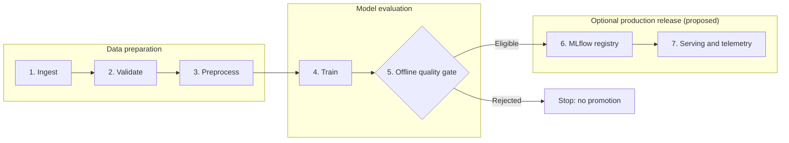
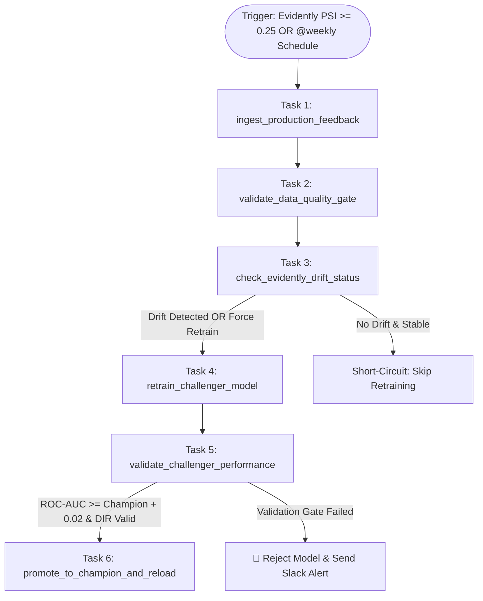

# DDM501: INDIVIDUAL ASSIGNMENT 2
# MACHINE LEARNING PIPELINE DESIGN & MLOps ANALYSIS

**Course:** DDM501 — AI in DevOps, DataOps, MLOps  
**Assignment:** Individual Assignment 2 (Weight: 5%)  
**Class:** MSA36HN_DDM501  
**System Title:** Enterprise Real-Time Credit Default Risk Scoring & Monitoring Platform  
**Target Domain:** Financial Technology (FinTech) / Digital Retail Banking  
**Data used for code experiments:** reproducible synthetic data matching the UCI feature schema; no UCI observations are included or used  
**Student Name:** Nguyễn Thái Thịnh<br>
**Student ID:** 25MS13304<br>
**Submission Date:** 5 October 2026<br>
**Submission PDF:** `DDM501_Assignment2_25MS13304_Nguyen_Thai_Thinh.pdf`

<div class="page-break"></div>

<h2>TABLE OF CONTENTS</h2>

- [Executive Summary](#executive-summary)
- [1. System Context](#1-continuation-from-assignment-1-system-context)
  - [Problem Statement Recap](#11-problem-statement-recap)
  - [Architecture Overview](#12-architecture-overview-refinements-from-sessions-3-5)
- [2. Pipeline Design](#2-pipeline-design-25)
  - [Proposed Pipeline Architecture](#21-proposed-production-pipeline-architecture)
  - [Stage Specifications and Quality Gates](#22-stage-specifications-and-quality-gates)
  - [Design Rationale](#23-design-rationale)
- [3. Experiments and Metrics](#3-experiment-tracking-metrics-analysis-25)
  - [Experiment Design](#31-experiment-design-and-variables)
  - [Metrics Strategy](#32-metrics-strategy-and-business-alignment)
  - [Experiment Results](#33-executed-experiment-matrix-10-configurations-results)
  - [Results Analysis](#34-results-analysis-recommendation)
  - [MLflow Integration Example](#35-mlflow-code-snippets)
- [4. Workflow Orchestration](#4-workflow-orchestration-design-20)
  - [Airflow DAG Architecture](#41-airflow-dag-architecture)
  - [Task Dependencies](#42-task-descriptions-and-dependencies)
  - [Scheduling Strategy](#43-scheduling-strategy)
  - [Airflow Code Example](#44-airflow-python-code-snippet)
- [5. Code Quality and Configuration](#5-code-quality-documentation-20)
- [6. Reproducibility and Versioning](#6-reproducibility-versioning-strategy-10)
- [7. Conclusion](#7-conclusion)
- [8. References](#8-references)

<div class="page-break"></div>

---

## EXECUTIVE SUMMARY

Building upon the conceptual architecture established in Individual Assignment 1, this document provides the engineering blueprint and technical analysis for the **Production Machine Learning Pipeline and MLOps Infrastructure** of the Enterprise Credit Default Risk Scoring Platform. In financial credit decisioning, static offline model training is insufficient; the platform requires robust data validation gates, systematic experiment tracking, automated closed-loop retraining orchestration, and strict multi-tier versioning.

This report separates an implemented local prototype from a proposed production architecture. The code runs a seven-step training/evaluation path on either an explicitly configured CSV or generated synthetic data, and executes ten scikit-learn configurations on a stratified holdout. The checked-in experiment outputs are local benchmark results, not MLflow runs or evidence of production performance.

The Airflow file defines a small optional DAG around the real training and candidate-gate functions; Airflow is not a project dependency and the DAG has not been deployed or executed here. The report's MLflow registry, drift-trigger, serving, object-store, and human-approval components are design proposals, not implemented integrations. All thresholds are engineering targets unless stated as measured results. Synthetic-data results cannot establish real-world credit risk performance, calibration, or fairness.

---

## 1. CONTINUATION FROM ASSIGNMENT 1 & SYSTEM CONTEXT

### 1.1 Problem Statement Recap
Assignment 1 proposed a hypothetical retail-credit system. Its volumes and service levels below are design targets, not measured operating baselines:

* Sub-50ms inference latency SLA ($p95 < 50\text{ms}$).
* Default discrimination power $ROC\text{-}AUC \ge 0.77$ and $F_1 \ge 0.52$.
* $75\%$ reduction in manual underwriting caseload via three-tier routing (`PRIME`, `NEAR_PRIME`, `SUBPRIME`, `HIGH_RISK`).
* A proposed Fair Lending screening range of $0.80 \le \text{DIR} \le 1.25$ and a separately validated, legally reviewed adverse-action explanation process; neither is implemented or legally assessed here.
* 99.9% service availability with graceful in-RAM fallback.

### 1.2 Architecture Overview & Refinements from Sessions 3–5
The following are proposed production refinements to the conceptual architecture; they are not integrations in this local prototype:
1. **Label Feedback Latency**: In credit lending, default outcomes are only realized 30–90 days post-origination. The pipeline must decouple real-time inference logging from delayed label ingestion, using a sliding-window data join mechanism.
2. **Automated Quality Gates**: Data schema drift and corrupted client payloads must be caught before training begins. Automated validation gates halt execution upon schema anomalies.
3. **Registry-Driven Serving Governance**: Production deployment must not rely on manual container redeployments. Serving microservices query MLflow Registry aliases (`@champion`) and hot-reload in-memory models via authenticated webhooks.

---

## 2. PIPELINE DESIGN (25%)

### 2.1 Proposed Production Pipeline Architecture

The diagram is a target architecture, not a record of deployed services. The runnable prototype currently covers local data loading, validation, preprocessing, training, and offline evaluation only.

The production ML pipeline is organized into seven decoupled, sequential stages with clear data contracts and validation checkpoints:



### 2.2 Stage Specifications and Quality Gates

The table below details the operational contract, data transformations, and acceptance gates for each pipeline stage:

| Stage # | Stage Name | Inputs | Key Operations | Outputs | Quality Gates / Pass Criteria |
| :---: | :--- | :--- | :--- | :--- | :--- |
| **1** | **Data Ingestion** | Explicit CSV path, or synthetic generator when no path is configured | Load CSV, normalize the target column name, or generate 5,000 synthetic demo rows. A configured but missing file raises `FileNotFoundError`; there is no implicit machine-specific fallback. | Local Pandas DataFrame. | File exists when configured; required columns are checked at the next stage. No database/feedback join is implemented. |
| **2** | **Data Validation** | Input DataFrame | Check required schema, nulls, finite numeric values, age/credit-limit bounds, categorical domains, and binary target. | Validated DataFrame or explicit `ValidationError`. | All implemented checks pass; no duplicate-request check because this prototype has no request ID. |
| **3** | **Preprocessing** | Validated features | Fit `ColumnTransformer` on training data: standardize 20 numeric features and one-hot encode 3 categorical features. Experiment 10 separately appends two ratio features. | 29-column encoded matrix for generated data, plus 2 ratios in experiment 10. | Fit preprocessing on train split only; unknown categories are ignored. No model serialization is implemented. |
| **4** | **Model Training** | Stratified 80% training split | Fit scikit-learn Logistic Regression, Random Forest, Gradient Boosting, or HistGradientBoosting estimators. The experiment matrix uses one fixed holdout, not cross-validation. | In-memory estimator. | Training completes; no LightGBM/XGBoost or artifact registry is implemented. |
| **5** | **Offline Evaluation** | Held-out 20% split | Compute ROC-AUC, F1, precision, recall, Brier score, p95 single-row model-call latency, and a binary-group DIR screening metric at threshold 0.30. | CSV/JSON comparison outputs. | Offline eligibility requires configured minimum ROC-AUC and DIR range; synthetic results are not a deployment approval. |
| **6** | **Experiment Tracking (proposed)** | Candidate metrics and artifacts | MLflow parameter/metric/artifact logging is a documented integration pattern only. | No MLflow run is created by current code. | Tracking server and registry integration remain future work. |
| **7** | **Serving & Rollout (proposed)** | Approved registered model | FastAPI serving, canary rollout, reload endpoint, and telemetry are design extensions only. | No serving service is included in this assignment prototype. | Requires separate implementation and load/security/governance validation. |

### 2.3 Design Rationale

1. **Modularity and Reusability**: The local `CreditRiskPipeline` separates ingestion, validation, preprocessing, training, and evaluation methods. It does not serialize a model/preprocessor bundle or test training-serving parity; those are requirements for a future serving integration.
2. **Error Handling and Recovery Strategies**: Implemented validation errors fail the local run explicitly. Preserving a deployed champion and alerting Slack/PagerDuty require a registry, release controller, and alert integration that are not part of this prototype.
3. **Scalability Considerations**: The synthetic demonstration loads 5,000 rows into memory. It does not query a sliding window, test distributed execution, measure cross-validation time, or include horizontally scaled serving. Those design choices need workload and infrastructure benchmarks.

---

## 3. EXPERIMENT TRACKING & METRICS ANALYSIS (25%)

### 3.1 Experiment Design and Variables

To compare ten candidate configurations, the script evaluates four scikit-learn estimator families on a fixed synthetic-data holdout. This is an exploratory demonstration, not a search for a production classifier:

* **Algorithms executed**:
  1. *Logistic Regression*: Linear baseline with L2 regularization ($C \in \{0.1, 1.0\}$).
  2. *Random Forest*: Bagging ensemble ($N \in \{100, 200\}$, Depth $\in \{5, 10\}$).
  3. *Gradient Boosting*: Estimators with varied tree depth and learning rate.
  4. *HistGradientBoosting*: Varied iterations, depth/leaves, weighting, and one engineered-feature variant.
  XGBoost and LightGBM are not dependencies and are not evaluated.
* **Feature Sets Tested**:
  - *Variant A (Raw Baseline)*: 23 raw features with standard scaling and one-hot encoding.
  - *Variant B (Engineered Ratios)*: 23 raw features + Credit Line Utilization Ratio ($\text{BILL\_AMT1} / \text{LIMIT\_BAL}$) + Payment-to-Bill Settlement Ratio ($\text{PAY\_AMT1} / \text{BILL\_AMT2}$).
* **Class Balancing Strategies**:
  - Unweighted (loss functions treat 0 and 1 equally).
  - Balanced class weights: scikit-learn's `class_weight="balanced"` option; weights are derived from training labels.

### 3.2 Metrics Strategy and Business Alignment

Model selection is guided by a balanced scorecard directly aligned with banking business outcomes:

1. **Primary Metric ($ROC\text{-}AUC$)**: Measures class separability across thresholds and is less sensitive to prevalence than accuracy. The proposed model target is $ROC\text{-}AUC \ge 0.7700$; the executable prototype uses a 0.7500 offline screening gate. Neither value is a legal or business approval.
2. **Key Operational Metric (Recall on Class 1 / Defaulters)**: Recall measures the fraction of labelled defaults found at the selected threshold. Its acceptable level must be chosen together with the costs of false approvals, false declines, and human review; no monetary cost ratio is measured in this assignment.
3. **Probability Quality (Brier Score)**: The Brier score measures squared error of predicted probabilities, but a single score is not a calibration proof. Evaluate reliability plots and calibration on representative data before pricing or decision use. The threshold $\text{Brier} \le 0.1200$ is a proposed target only.
4. **Group Screening Metric (Disparate Impact Ratio - DIR)**: For this prototype, DIR is the ratio of approval rates for the configured binary groups:
   $$\text{DIR} = \frac{P(\text{Approved} \mid \text{SEX}=2)}{P(\text{Approved} \mid \text{SEX}=1)}$$
   The range $0.80 \le \text{DIR} \le 1.25$ is a screening threshold in this exercise, not a legal conclusion or a complete fairness audit. The utility fails explicitly if a group is missing or the reference approval rate is zero.
5. **Prototype Inference Timing**: The experiment script reports local p95 model-call time after warm-up. It excludes preprocessing, API, database, and network time; it must not be compared directly with an end-to-end serving SLA.

### 3.3 Executed Experiment Matrix (10 Configurations) & Results

The script trains each configuration on one fixed, stratified 80/20 split of 5,000 generated synthetic rows (seed 42); the generated target prevalence is 21.04%. These are one-run results on synthetic data—not UCI benchmark results, cross-validation estimates, MLflow runs, or production measurements. A classification threshold of 0.30 is used for F1, precision, recall, and DIR. The p95 column is the local p95 of 200 warmed-up single-row `predict_proba` calls; preprocessing, API, database, and network latency are excluded. The recorded environment is Python 3.14.7, scikit-learn 1.9.1, NumPy 2.5.3, and pandas 3.0.6 on Apple Silicon/macOS; see `experiment_metadata.json` for the full run metadata.

| Exp # | Estimator | Configuration | Weighting | ROC-AUC | F1 | Precision | Recall | Brier | p95 (ms) | DIR | Offline status |
| :---: | :--- | :--- | :---: | :---: | :---: | :---: | :---: | :---: | :---: | :---: | :--- |
| **01** | Logistic Regression | $C=1.0$, raw inputs | None | 0.7014 | 0.3759 | 0.3968 | 0.3571 | 0.1519 | 0.03 | 0.9367 | Baseline |
| **02** | Logistic Regression | $C=0.1$, raw inputs | Balanced | 0.6996 | 0.3765 | 0.2349 | 0.9476 | 0.2208 | 0.03 | 0.4981 | Rejected |
| **03** | Random Forest | 100 trees, depth 5 | None | 0.6749 | 0.3743 | 0.4527 | 0.3190 | 0.1520 | 1.78 | 1.0163 | Rejected |
| **04** | Random Forest | 200 trees, depth 10 | Balanced | 0.6790 | 0.3703 | 0.2322 | 0.9143 | 0.1917 | 4.14 | 0.5761 | Rejected |
| **05** | Gradient Boosting | 100 estimators, LR 0.05, depth 4 | None | 0.6911 | 0.4205 | 0.4322 | 0.4095 | 0.1500 | 0.06 | 1.0126 | Rejected |
| **06** | Gradient Boosting | 200 estimators, LR 0.03, depth 6 | None | 0.6801 | 0.4160 | 0.4392 | 0.3952 | 0.1528 | 0.08 | 0.9759 | Rejected |
| **07** | HistGradientBoosting | 100 iterations, LR 0.05, depth 5 | None | 0.6888 | 0.4293 | 0.4400 | 0.4190 | 0.1506 | 3.41 | 0.9896 | Rejected |
| **08** | HistGradientBoosting | 150 iterations, LR 0.05, depth 6 | Balanced | 0.6708 | 0.3811 | 0.2580 | 0.7286 | 0.1911 | 4.04 | 0.8225 | Rejected |
| **09** | HistGradientBoosting | 200 iterations, LR 0.03, 31 leaves | Balanced | 0.6805 | 0.3913 | 0.2675 | 0.7286 | 0.1858 | 5.38 | 0.7712 | Rejected |
| **10** | HistGradientBoosting | Exp. 09 + 2 financial ratios | Balanced | 0.6706 | 0.3904 | 0.2714 | 0.6952 | 0.1837 | 5.28 | 0.8086 | Rejected |

### 3.4 Results Analysis & Recommendation

1. **Observed patterns in this synthetic run**:
   - No estimator reaches the configured minimum ROC-AUC of 0.75. Therefore, the offline quality gate correctly selects **no candidate**; no model is labelled a champion.
   - Class weighting raises recall in this split (for example, Experiment 02 reaches 0.9476) while sharply lowering precision and worsening Brier score. That trade-off requires a business-defined operating point; recall alone is not a model-selection objective.
   - The engineered-ratio variant does not improve ROC-AUC over its HistGradientBoosting counterpart in this run. The p95 figures vary with the local execution environment and are model-only, not an API SLA.
2. **Recommendation**:
   - Do not promote any model from this experiment. Obtain and govern a representative dataset, establish a leakage-safe evaluation protocol, compare repeated holdouts or cross-validation, calibrate probabilities, audit relevant/intersectional cohorts, and then reconsider thresholds and candidate gates.

### 3.5 MLflow Code Snippets

The following is an illustrative next-step integration pattern, not part of the executed experiment code; MLflow is not a declared dependency and no run or model version is created by it:

```python
import mlflow

def log_candidate(tracking_uri, experiment_name, estimator, params, metrics):
    mlflow.set_tracking_uri(tracking_uri)
    mlflow.set_experiment(experiment_name)
    with mlflow.start_run():
        mlflow.log_params(params)
        mlflow.log_metrics(metrics)
        mlflow.sklearn.log_model(estimator, artifact_path="model")
```

Registry registration and promotion should be separate governed steps after validation; this snippet neither registers nor promotes a model.

---

## 4. WORKFLOW ORCHESTRATION DESIGN (20%)

### 4.1 Airflow DAG Architecture

The production design may use Airflow to coordinate delayed-label ingestion, drift checks, candidate evaluation, and a separately approved release. This six-task diagram is a proposal; the checked-in prototype implements only training/evaluation and its offline quality gate.



### 4.2 Task Descriptions and Dependencies

1. **Feedback ingestion (proposed)**: Connect a governed source of matured labels to prediction records using a stable request key. No database or delayed-label join is implemented here.
2. **Data validation (implemented locally)**: The prototype checks schema, nulls, finite numeric values, selected domains, and a binary target. It does not check identifiers or duplicate requests.
3. **Drift monitoring (proposed)**: Add a reference-data PSI or other justified drift test using production data. No Evidently integration or PSI computation exists in this code.
4. **Candidate training (implemented locally)**: The prototype trains scikit-learn estimators on CSV or synthetic data with a single stratified holdout; it does not run five-fold cross-validation or log to MLflow.
5. **Candidate quality gate (implemented locally)**: The pipeline records whether the candidate passes the configured minimum ROC-AUC and DIR range. A failed candidate must not proceed:
   - Minimum ROC-AUC and DIR bounds are configured, but this synthetic experiment passed neither model-quality eligibility across the ten configurations; it does not compare against a champion.
6. **Registry, approval, and serving (proposed)**: MLflow registration, human approval, alias promotion, and authenticated API reload are future integrations. The current code performs no model registration, champion promotion, or deployment.

### 4.3 Scheduling Strategy

* **Proposed trigger strategy**: A scheduled evaluation can run weekly, while a separately implemented monitoring service may trigger evaluation on a validated drift condition. The exact cadence and PSI thresholds need operational evidence. The prototype DAG, when Airflow is installed, has a weekly schedule but does not implement event-triggering or label ingestion.

### 4.4 Airflow Python Code Snippet

The following shows the task callables from the actual optional DAG prototype in `airflow_dag.py`. The module also creates a weekly two-task DAG when Airflow is installed. It trains/evaluates a candidate and fails the DAG if configured gates fail; it does not claim to be production-ready:

```python
from airflow.exceptions import AirflowFailException

def task_train_and_evaluate(**context):
    from pipeline import CreditRiskPipeline
    return CreditRiskPipeline().run_pipeline()

def task_candidate_quality_gate(**context):
    metrics = context["ti"].xcom_pull(task_ids="train_and_evaluate_candidate")
    if not isinstance(metrics, dict) or not metrics.get("passed_quality_gates", False):
        raise AirflowFailException("Candidate failed offline gates; no model is promoted.")
    return {"status": "eligible_for_manual_review", "metrics": metrics}
```

### 4.5 Operational Considerations

* **Failure handling**: The prototype configures two retries and a five-minute retry delay; it has no exponential backoff, database integration, alert callback, or deployment.
* **Alerting/monitoring**: Slack, Prometheus, and Grafana integration are proposed work and have not been wired to this DAG.

---

## 5. CODE QUALITY & DOCUMENTATION (20%)

### 5.1 Code Standards

The checked-in code uses focused functions, basic type annotations, docstrings, Pydantic configuration models, and explicit input/gate errors. No Flake8/Ruff configuration, CI lint job, 100% annotation audit, production security controls, or complete system-wide exception policy is included. The test suite validates implemented contracts; it is not proof of production reliability.

### 5.2 Configuration Management Pattern

The executable loader reads the nested YAML schema in `config.yaml` and applies `APP_ENV`, `DATA_PATH`, and `MLFLOW_TRACKING_URI` environment overrides. Database, object-store, and serving settings are not implemented.

```python
from config import PipelineConfig

settings = PipelineConfig.load()
print(settings.model.min_roc_auc_gate)
print(settings.storage.mlflow_tracking_uri)
```

The source module is the authoritative configuration example; MLflow URI configuration does not imply that an MLflow client is installed or connected.

---

## 6. REPRODUCIBILITY & VERSIONING STRATEGY (10%)

### 6.1 Three-Tier Versioning Architecture

The following is a proposed production strategy. The assignment repository itself currently versions code in Git and records the synthetic experiment outputs; DVC, MinIO, and MLflow are not integrated:

```
┌─────────────────────────────────────────────────────────────────────────────┐
│                       THREE-TIER VERSIONING MATRIX                          │
├───────────────────┬────────────────────────────┬────────────────────────────┤
│ TIER              │ TOOL & MECHANISM           │ TRACKING ARTIFACT          │
├───────────────────┼────────────────────────────┼────────────────────────────┤
│ 1. Code Tier      │ Git + GitFlow Branching    │ Git Commit SHA (e.g. 7f8a9)│
│                   │ Conventional Commits       │ Release Tag: v1.0.0        │
├───────────────────┼────────────────────────────┼────────────────────────────┤
│ 2. Data Tier      │ DVC (Data Version Control) │ .dvc Pointer Hash          │
│                   │ MinIO S3 Object Store      │ s3://credit-mlops/data/v1  │
├───────────────────┼────────────────────────────┼────────────────────────────┤
│ 3. Model Tier     │ MLflow Model Registry      │ Model Version (v1, v2)     │
│                   │ Staging Aliases            │ @champion, @challenger     │
└───────────────────┴────────────────────────────┴────────────────────────────┘
```

1. **Code Versioning (proposed Git workflow)**:
   - Branching strategy: GitFlow (`main` for production releases, `develop` for integration, `feature/*` for pipeline additions).
   - Conventional Commits: Enforces semantic commit messages (`feat:`, `fix:`, `refactor:`, `test:`, `docs:`).
2. **Data Versioning (proposed DVC & object storage)**:
   - A future governed dataset and monthly feedback snapshots could be stored in an approved object store.
   - DVC generates lightweight `.dvc` tracking files committed to Git, enabling point-in-time recovery of the exact training dataset used for any historical model.
3. **Model Versioning (proposed MLflow Registry)**:
   - A future integration should record code revisions, data fingerprints, hyperparameters, and environment dependencies for each run.
   - Dynamic aliases (`@champion` and `@challenger`) decouple physical model versions from downstream serving logic, allowing instantaneous traffic shifting and automated rollbacks.

### 6.2 Reproducibility Code Snippets

* **Seed control used by the prototype**:
```python
import random
import numpy as np

def seed_everything(seed: int = 42) -> None:
    """Seeds Python and NumPy; this alone does not guarantee bitwise reproducibility."""
    random.seed(seed)
    np.random.seed(seed)
```

Setting `PYTHONHASHSEED` inside a running process does not reset its hash seed. The experiments also set estimator and split seeds, but platform/library differences and measured latency remain variable.

* **Multi-Stage Production Dockerfile (Powered by `uv`)**:
  
The Dockerfile below is a deployment sketch only. It is not included in this repository, has not been built, and references serving modules that are outside this assignment.

```dockerfile
# Stage 1: Build stage with uv
FROM python:3.11-slim AS builder
WORKDIR /app
RUN apt-get update && apt-get install -y --no-install-recommends curl ca-certificates && rm -rf /var/lib/apt/lists/*
COPY --from=ghcr.io/astral-sh/uv:0.12.17 /uv /bin/uv

COPY pyproject.toml uv.lock ./
RUN uv export --no-dev -o requirements.txt

# Stage 2: Minimal hardened runtime
FROM python:3.11-slim AS runner
WORKDIR /app
RUN groupadd -r appuser && useradd -r -g appuser appuser

COPY --from=builder /app/requirements.txt .
RUN pip install --no-cache-dir -r requirements.txt

COPY src/ ./src/
COPY app/ ./app/
COPY config.yaml .

USER appuser
EXPOSE 8000

HEALTHCHECK --interval=30s --timeout=5s --retries=3 \
  CMD curl -f http://localhost:8000/health || exit 1

CMD ["uvicorn", "app.main:app", "--host", "0.0.0.0", "--port", "8000"]
```

---

## 7. CONCLUSION

This assignment provides a runnable local pipeline prototype, tests for its implemented contracts, a ten-configuration synthetic-data experiment, and a proposed production MLOps architecture. In the recorded experiment, no candidate met the configured ROC-AUC gate, so the correct outcome is **no promotion**. The results do not establish performance on real credit data, fairness compliance, calibration, or production latency.

The Airflow prototype is limited to candidate training/evaluation and an offline gate. MLflow, Evidently, DVC, object storage, serving, monitoring, and production release controls remain proposed extensions. The next evidence needed is a lawful representative dataset, a leakage-aware evaluation plan, independent fairness/calibration assessment, integration tests, and operational validation.

---

## 8. REFERENCES

1. Yeh, I. C., & Lien, C. H. (2009). The comparisons of data mining techniques for the predictive accuracy of probability of default of credit card clients. *Expert Systems with Applications*, 36(2), 2473-2480.
2. Zaharia, M., Chen, A., Davidson, A., et al. (2018). Accelerating the Machine Learning Lifecycle with MLflow. *IEEE Data Engineering Bulletin*, 41(4), 39-45.
3. Ke, G., Meng, Q., Finley, T., et al. (2017). LightGBM: A highly efficient gradient boosting decision tree. *Advances in Neural Information Processing Systems (NeurIPS 2017)*.
4. Apache Airflow Project. *Apache Airflow Documentation*. https://airflow.apache.org/docs/
5. MLflow Project. *MLflow Tracking Documentation*. https://mlflow.org/docs/latest/ml/tracking/
6. US Consumer Financial Protection Bureau (CFPB). (2022). *Consumer Financial Protection Circular 2022-03: Adverse action notification requirements in connection with credit decisions based on complex algorithms*.
